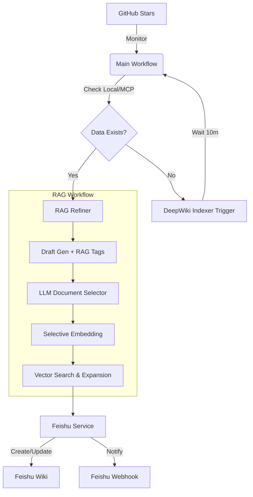

以下是您提供的 **MCP DeepWiki Documentation Automator** 项目文档的中英对照版本，已按段落结构进行双语排版，便于阅读与参考：

---

# MCP DeepWiki Documentation Automator  
# MCP DeepWiki 文档自动化工具

An automated pipeline that monitors GitHub Stars, fetches technical documentation via DeepWiki MCP, refines content using a RAG (Retrieval-Augmented Generation) workflow, and publishes polished Chinese wikis to Feishu (Lark).  
一个自动化流水线，用于监控 GitHub 星标仓库，通过 DeepWiki MCP 获取技术文档，利用 RAG（检索增强生成）工作流优化内容，并将高质量的中文 Wiki 发布至飞书（Lark）。

---

## 🚀 Key Features  
## 🚀 核心功能

- **GitHub Star Monitoring**: Automatically tracks new starred repositories every 30 seconds.  
  **GitHub 星标监控**：每 30 秒自动检测新增的星标仓库。

- **Intelligent Documentation Fetching**:  
  **智能文档获取**：
  - Seamless integration with [DeepWiki MCP](https://deepwiki.com).  
    无缝集成 [DeepWiki MCP](https://deepwiki.com)。
  - **Lightweight Indexing Trigger**: Automatically requests DeepWiki to index new repositories using Next.js Server Actions (Memory-efficient, 2G RAM friendly).  
    **轻量级索引触发器**：通过 Next.js Server Actions 自动请求 DeepWiki 对新仓库建立索引（内存高效，仅需 2GB RAM）。

- **RAG-Powered Refinement**:  
  **RAG 驱动的内容精炼**：
  - **Phase 1: Smart Drafting**: Generates a structured draft in Chinese with RAG placeholders (`<!-- NEED_RAG -->`) for complex concepts.  
    **第一阶段：智能草稿生成**：生成结构化的中文初稿，并为复杂概念插入 RAG 占位符（`<!-- NEED_RAG -->`）。
  - **Phase 2: Targeted Embedding**: Uses LLM to select only the most relevant documents for embedding, saving significant API costs and local resources.  
    **第二阶段：定向嵌入**：利用大语言模型（LLM）仅选择最相关的文档进行向量化，大幅节省 API 调用成本和本地资源。
  - **Phase 3: Deep Expansion**: Context-aware expansion of placeholders using vector search and background knowledge.  
    **第三阶段：深度扩展**：基于向量检索与背景知识，对占位符进行上下文感知的扩展填充。

- **Feishu (Lark) Integration**:  
  **飞书（Lark）集成**：
  - Automatic creation of Wiki nodes.  
    自动创建 Wiki 页面节点。
  - Formats content into high-quality Feishu Docx blocks (Titles, Code Blocks, Lists).  
    将内容格式化为高质量的飞书 Docx 区块（标题、代码块、列表等）。
  - Real-time notifications via Feishu Webhook (Card and Text messages).  
    通过飞书 Webhook 实时推送通知（卡片消息与文本消息）。

- **Status Dashboard**: A clean, FastAPI-powered web UI to monitor the processing status of all repositories.  
  **状态仪表盘**：基于 FastAPI 的简洁 Web 界面，用于监控所有仓库的处理状态。

---

## 🏗️ Implementation Logic  
## 🏗️ 实现逻辑



1. **Discovery**: `GitHubMonitor` polls the user's starred repositories.  
   **发现阶段**：`GitHubMonitor` 定期轮询用户的 GitHub 星标仓库。

2. **Acquisition**: `mcp_client` attempts to fetch Markdown pages. If the repo isn't indexed, `DeepWikiIndexer` submits a direct HTTP POST (Server Action) to DeepWiki to trigger indexing.  
   **获取阶段**：`mcp_client` 尝试拉取 Markdown 页面。若仓库未被索引，`DeepWikiIndexer` 会通过 HTTP POST（Server Action）直接请求 DeepWiki 启动索引。

3. **Refinement**: `RAGRefiner` processes the "Overview" page. It identifies "blind spots" that need more info, selects relevant supplementary files from the repo, embeds them into a local vector store, and performs a final rewrite to ensure a high-quality, architecture-focused Chinese document.  
   **精炼阶段**：`RAGRefiner` 处理“概览”页面，识别需要补充信息的“盲点”，从仓库中选取相关辅助文件，将其嵌入本地向量数据库，并最终重写为高质量、聚焦架构的中文文档。

4. **Publishing**: `FeishuService` maps the Markdown to Feishu's Block API and handles document updates and notifications.  
   **发布阶段**：`FeishuService` 将 Markdown 映射为飞书 Block API 格式，处理文档更新与通知推送。

---

## 🛠️ Deployment  
## 🛠️ 部署指南

### 1. Prerequisites  
### 1. 前置条件

- Python 3.10+  
- 至少 2GB 内存的服务器（已针对低资源环境优化）  
- GitHub Personal Access Token  
- 具备 Wiki 和 Docx 权限的飞书应用  
- OpenAI 兼容的 API 密钥（如 DeepSeek、Qwen、Zhipu 或 OpenAI）

### 2. Installation  
### 2. 安装步骤

```bash
git clone https://github.com/your-repo/mcp_deepwiki.git  
cd mcp_deepwiki
pip install -r requirements.txt
```

### 3. Configuration  
### 3. 配置说明

在项目根目录创建 `.env` 文件：

```env
GITHUB_TOKEN=your_github_token
FEISHU_APP_ID=your_app_id
FEISHU_APP_SECRET=your_app_secret
FEISHU_SPACE_ID=your_wiki_space_id
FEISHU_WEBHOOK_URL=your_webhook_url

OPENAI_API_KEY=your_llm_api_key
OPENAI_BASE_URL=https://api.your-provider.com/v1  
OPENAI_MODEL=gpt-4o # or qwen-max, etc.
EMBEDDING_MODEL=text-embedding-v3

USER_EMAIL=your_email@example.com # Used for DeepWiki indexing requests
```

### 4. Running the Application  
### 4. 启动应用

**使用 Screen（推荐用于长期运行）**：  
```bash
screen -S mcp
python3 main.py
# 按 Ctrl+A，再按 D 退出会话
```

**使用 Nohup**：  
```bash
nohup python3 main.py > mcp.log 2>&1 &
```

仪表盘将可通过 `http://your-server-ip:8002` 访问。

---

## 📝 License  
## 📝 许可证

MIT License. Feel free to use and contribute!  
MIT 许可证。欢迎使用与贡献！